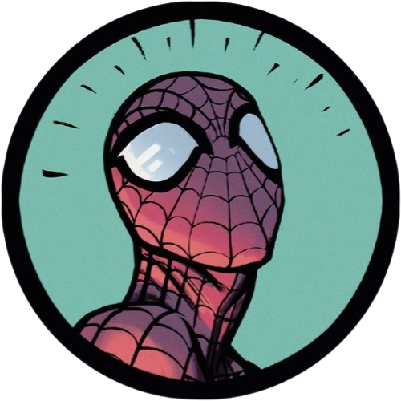

<a name="readme-top">

<br/>

<br />
<div align="center">
  <a href="https://github.com/aymliekTT">
  <!-- TODO: If you want to add a logo or banner you can add it here -->
    
  </a>
<!-- TODO: Change Title to the name of the title of your Project -->
  <h3 align="center">Header and Footer Designs</h3>
</div>
<!-- TODO: Make a short description -->
<div align="center">
  This project showcases various designs and animations for headers and footers using HTML and CSS.
</div>

<br />

<!-- TODO: Change the zyx-0314 into your github username  -->
<!-- TODO: Change the WD-Template-Project into the same name of your folder -->


---

<br />
<br />

<!-- TODO: If you want to add more layers for your readme -->
<details>
  <summary>Table of Contents</summary>
  <ol>
    <li>
      <a href="#overview">Overview</a>
      <ol>
        <li>
          <a href="#key-components">Key Components</a>
        </li>
        <li>
          <a href="#technology">Technology</a>
        </li>
      </ol>
    </li>
    <li>
      <a href="#rule,-practices-and-principles">Rules, Practices and Principles</a>
    </li>
    <li>
      <a href="#resources">Resources</a>
    </li>
  </ol>
</details>

---

## Overview

<!-- TODO: To be changed -->
<!-- The following are just sample -->
Description of the project in detail.

Guiding Question:
- What is the project?
  - The project is to make five static and animated headers and footers.
- What is the purpose?
  - The goal is to showcase different layout styles, colors, typography, and responsive design techniques to create visually appealing and functional headers and footers for web pages.
- What are the key components?
  - It is a multipage website with a landing page, header gallery page, and footer gallery page. The galleries showcase animations of the headers and footers.
- What technology is used and how is it used?
  - The technologies used on this website are HTML and CSS. The HTML is used to lay out the headers and footers, while the CSS makes it more visually pleasing and interactive.

### Key Components
<!-- TODO: List of Key Components -->
<!-- The following are just sample -->
- MultiPage Website
- Animations


### Technology
<!-- TODO: List of Technology Used -->


## Rules, Practices and Principles
1. Always use `WD-` in the front of the Title of the Project for the Subject followed by your custom naming.
2. Do not rename any .html files; always use `index.html` as the filename.
3. Place Files in their respective folders.
4. All file naming is in camel case.
   - Camel case is a naming format where there is no white space in the separation of each word, the first word is in all lower case while the succeding word's first letter is in upper followed by lower case letters.
   - ex.: buttonAnimatedStyle.css
5. Use only `External CSS`.
6. Renaming of Pages folder names are a must and relates to what it is doing or data it holding.
7. File Structure to follow below.

```
WD-ProjectName
└─ assets
|   └─ css
|   |   └─ style.css
|   └─ img
|   |   └─ fileWith.jpeg/.jpg/.webp/.png
|   └─ js
|       └─ script.js
└─ pages
|  └─ pageName
|     └─ assets
|     |  └─ css
|     |  |  └─ style.css
|     |  └─ img
|     |  |  └─ fileWith.jpeg/.jpg/.webp/.png
|     |  └─ js
|     |     └─ script.js
|     └─ index.html
└─ index.html
└─ readme.md
```

## Resources

<!-- TODO: Add References -->
| Title | Purpose | Link |
|-|-|-|
| Font Awesome Link | It puts icons on the website. | https://cdnjs.com/libraries/font-awesome |
| Google Fonts | It changes the fonts of the text inside the website. | https://fonts.google.com/ |
